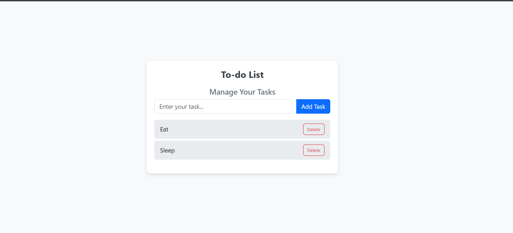

# 📝 To-Do List App

A simple and responsive To-Do List web application where users can add and delete tasks.  
This project is built using **HTML**, **CSS**, **Bootstrap**, and **JavaScript**.

---

## 🚀 Features

- ✅ Add new tasks  
- 🗑️ Delete existing tasks  
- 📱 Responsive layout using Bootstrap  
- ⚡ Smooth UI interactions with JavaScript  

---

## 📸 Preview

---

## 🛠️ Tech Stack

- **HTML**
- **CSS**
- **Bootstrap 5**
- **Vanilla JavaScript**

---

## 📂 Project Structure

- index.html
- style.css
- app.js
- screenshot.png
- README.md

## 🧠 How It Works

1. User types a task in the input field.
2. Clicks the **"Add Task"** button.
3. Task appears in the list below.
4. Click **"Delete"** button to remove any task.

## 👨‍💻 Author

Made by **Amar Singh**

## 📬 Contact

Reach me at: amar298976@gmail.com